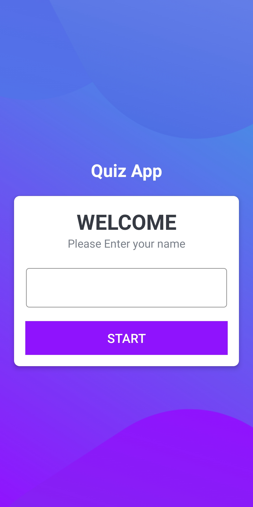
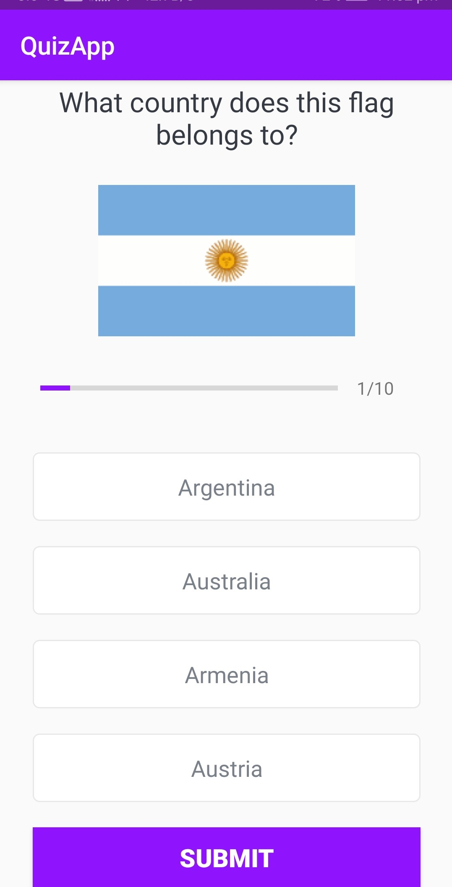
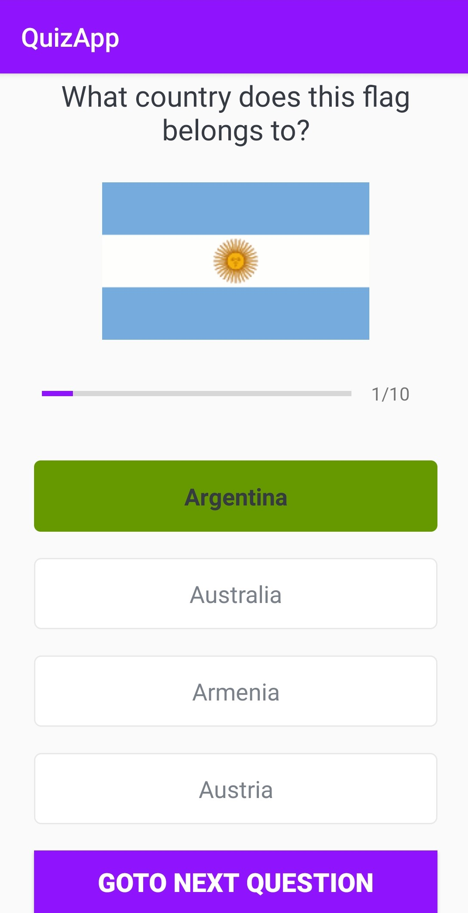
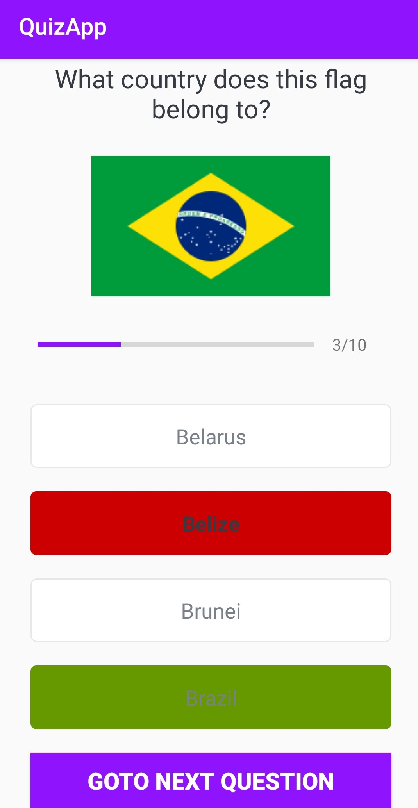

## Quiz Android APP 

Language: Kotlin

### Features

- User can enter name and start the quiz. 
- User will see quiz questions and answser in scollable view. 
- User can see the wrong and correct answer on submission. 
- User can goto next question to see new question on screen. 
- At the end results will be displayed with number of right and wrong answers. 

### Welcome Screen 

### Questions screen 

### Result screen

